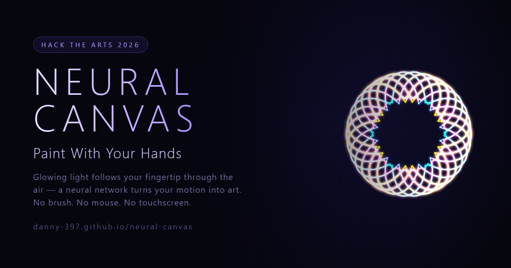

# Neural Canvas



> **Paint glowing light in mid-air — with your bare hands.**
> A neural network watches your motion through the webcam and turns it into living art.
> No brush. No mouse. No touchscreen.

*Built for **Hack the Arts 2026** — the theme: art that wouldn't exist without technology.*

▶ **Live demo:** https://danny-397.github.io/neural-canvas/

---

## What it is

Neural Canvas turns your webcam into a paintbrush. A pre-trained hand-tracking model
follows your fingers in real time; you **pinch your thumb and index finger together** and
glowing light streams from your fingertip as you move through the air. Change colors, erase,
undo, and clear — all with **hand gestures**, never the keyboard.

The technology isn't a filter layered on top of the art — it's the only reason the art can
exist, because it's the thing that can *see* you paint.

## How to use it

1. Open the [live demo](https://danny-397.github.io/neural-canvas/) and press **Start camera** (allow camera access).
2. **🤏 Pinch** your thumb and index finger together — light paints from your fingertip.
3. Move your hand to draw; unpinch to lift the "pen." Both hands work at once.

### Gestures

| Gesture | Action |
|---|---|
| 🤏 Pinch | Paint |
| ✋ Open palm | Erase |
| ✌️ Victory | Next color |
| 👎 Thumb down | Undo |
| 👍 Thumb up | Clean view (hide the UI to admire or screenshot) |
| ✊ Fist (hold) | Clear the canvas |

## Features

- **Live hand tracking** — locates 21 3D points on each hand ~60× a second, fully on-device.
- **Brushes** — Neon glow, Ribbon, Spray, Comet, and live **Embers** that drift up and fade.
- **Kaleidoscope symmetry** — mirror or 4 / 6 / 8-fold folding turns a single stroke into a
  living mandala.
- **Full-body mode** — swaps in a pose model so you can paint with your whole body.
- **Two-hand colors, rainbow, backdrops, and bloom.**
- **Attract mode** — left idle, the canvas paints its own drifting mandala to draw a crowd,
  then hands control back the moment someone raises a hand.
- **Undo, fullscreen, Save PNG, and Record WebM.**

## How it works

Every webcam frame is passed to Google's **MediaPipe Tasks Vision** gesture/hand model,
which returns the 3D position of each hand joint and a classified gesture. The app reads
those points — your index fingertip is the brush, a pinch is the pen — and a
[**one-euro filter**](https://gery.casiez.net/1euro/) smooths the raw tracking so lines stay
clean without feeling laggy. Symmetry applies a set of coordinate transforms to every stroke
to fold it into a live kaleidoscope, and strokes are rendered with the Canvas 2D API using
additive blending and shadow-blur glow.

## Privacy

Everything runs **entirely in your browser**. The camera feed is processed on your device
and **never leaves it** — there is no server, no upload, and no account.

## Tech

Pure HTML / CSS / JavaScript in a single file — no build step, no framework, no server.
MediaPipe Tasks Vision (WebAssembly + GPU) is loaded from a CDN; everything else is vanilla.

```
index.html    → the app (open it, that's the whole thing)
paint.html    → redirect to index.html (kept so earlier shared links still resolve)
preview.png   → social/share cover image
archive/      → an earlier experiment, kept for reference: an abstract generative-art
                tool built on a CPPN/SIREN neural network that computes an image directly
                from pixel coordinates. The hand-painting app above is the submission.
```

Run it locally over a secure context (the camera API requires `https://` or `localhost`):

```bash
# from the repo root
python -m http.server 8000
# then open http://localhost:8000
```

## Credits

- Hand & pose tracking: [Google MediaPipe Tasks Vision](https://developers.google.com/mediapipe)
- Tracking smoothing: the [1€ Filter](https://gery.casiez.net/1euro/) (Casiez, Roussel & Vogel)

## License

Released under the [MIT License](LICENSE).

---

Created for **Hack the Arts 2026** — *art that wouldn't exist without technology.*
